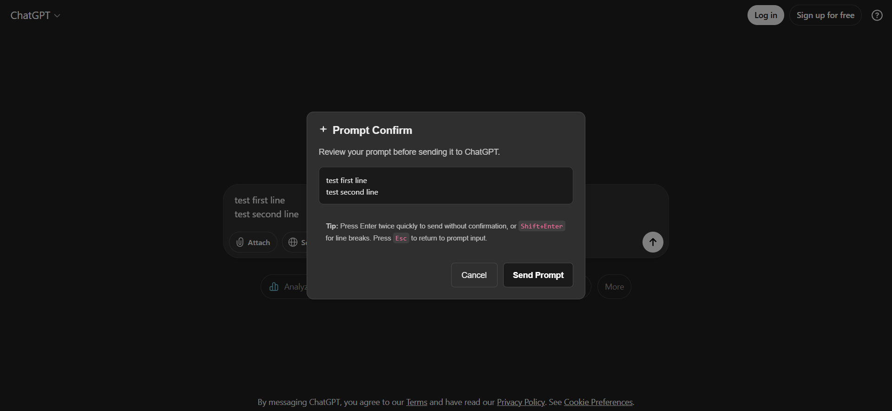

# 🛡️ Prompt Confirm - Chrome Extension

> A simple yet powerful Chrome extension that prevents accidental ChatGPT prompt submissions by adding a confirmation dialog before sending messages.


## 🤔 The Problem

We've all been there - you're crafting a detailed, thoughtful prompt for ChatGPT, you want to add a new paragraph or line break, so you press Enter... only to watch in frustration as your **incomplete message gets sent immediately**.

This leads to:

- ⏹️ Quickly trying to stop the AI's response (if you're fast enough)
- ✏️ Clicking the edit button to modify your message
- ➕ Adding the rest of your intended prompt
- 🔄 Sending it again, hoping the context isn't lost
- 💸 Wasting tokens and disrupting your thought process

## 💡 The Solution

**Prompt Confirm** eliminates this frustration by adding a simple confirmation step before sending any message to ChatGPT. No more accidents, no more incomplete prompts, no more wasted time!

## ✨ Features

### 🔐 Smart Enter Protection

- **Single Enter**: Shows confirmation dialog to review your message
- **Double Enter**: Sends immediately (like the original behavior)
- **Shift+Enter**: Creates line breaks (unchanged)

### 🎨 Beautiful Dark Theme UI

- Clean, unobtrusive confirmation dialog
- Message preview with scrolling for long prompts
- Matches ChatGPT's dark theme aesthetic
- Smooth animations and transitions

### ⚡ Seamless Integration

- Works on both `chat.openai.com` and `chatgpt.com`
- No setup required - works immediately after installation
- Preserves all existing keyboard shortcuts
- Zero impact on ChatGPT's performance

### 🔒 Privacy First

- **No data collection** - everything runs locally
- **No external servers** - completely offline functionality
- **No permissions abuse** - only runs on ChatGPT pages
- Open source and transparent

## 🚀 Installation

1. **From Chrome Web Store** (Recommended)

   [](https://chromewebstore.google.com/detail/prompt-confirm/ppbmlophbfhjlhmegeoklkdpenedahfg)

2. **Manual Installation** (Developer Mode)

   ```bash
   # Clone or download this repository
   git clone https://github.com/your-username/prompt-confirm.git

   # Open Chrome and go to chrome://extensions/
   # Enable "Developer mode" (top right toggle)
   # Click "Load unpacked" and select the extension folder
   ```

## 🎯 How It Works

### Normal Flow (With Extension)

1. Type your prompt in ChatGPT
2. Press **Enter** once
3. Review your message in the confirmation dialog
4. Click **"Send Prompt"** to confirm or **"Cancel"** to continue editing

### Quick Send (Power Users)

1. Type your prompt
2. Press **Enter** twice quickly (within 400ms)
3. Message sends immediately (no confirmation)

### Line Breaks

- **Shift+Enter**: Still creates line breaks as normal
- **Escape**: Closes confirmation dialog and returns to editing

## 🎪 Demo



_The confirmation dialog shows a preview of your message and provides clear options to send or cancel._

## 📁 Project Structure

```
prompt-confirm/
├── content.js          # Main extension logic
├── manifest.json       # Extension configuration
├── privacy-policy.md   # Privacy policy
├── LICENSE            # MIT License
├── README.md          # This file
└── images/            # Extension icons
    ├── icon-16.png
    ├── icon-32.png
    ├── icon-48.png
    ├── icon-128.png
    └── icon.svg
```

## 🛠️ Technical Details

### Architecture

- **Manifest V3** compatible
- **Content Script** injection on ChatGPT domains
- **Event-driven** keyboard monitoring
- **CSS-only** dark theme styling

### Permissions Used

- `activeTab`: Required to inject content scripts into active ChatGPT tabs
- Host permissions for `chat.openai.com` and `chatgpt.com`: Required to run on ChatGPT domains

### Browser Compatibility

- ✅ Chrome (Manifest V3)
- ✅ Edge (Chromium-based)
- ✅ Other Chromium browsers

## 🎨 Customization

The extension uses a carefully crafted dark theme that matches ChatGPT's interface. The styling is defined in [`content.js`](content.js) and includes:

- Responsive design for different screen sizes
- Smooth animations and transitions
- Accessible color contrast ratios
- Custom scrollbars for long message previews

## 🐛 Troubleshooting

### Extension Not Working?

1. Refresh the ChatGPT page
2. Check if the extension is enabled in `chrome://extensions/`
3. Ensure you're on `chat.openai.com` or `chatgpt.com`

### Confirmation Not Showing?

1. Check browser console for any errors
2. Try disabling other extensions that might interfere
3. Clear browser cache and reload

### Double Enter Not Working?

- The double-enter threshold is 400ms - try pressing Enter twice more quickly

## 🤝 Contributing

Contributions are welcome! Please feel free to submit a Pull Request. For major changes, please open an issue first to discuss what you would like to change.

### Development Setup

```bash
# Clone the repository
git clone https://github.com/your-username/prompt-confirm.git

# Load the extension in Chrome
# 1. Go to chrome://extensions/
# 2. Enable Developer mode
# 3. Click "Load unpacked" and select the project folder
# 4. Make changes to content.js
# 5. Reload the extension to test changes
```

## 📜 Privacy Policy

This extension:

- ✅ Does **NOT** collect any user data
- ✅ Does **NOT** store personal information
- ✅ Does **NOT** transmit data to external servers
- ✅ Only operates locally within your browser
- ✅ Respects your privacy completely

Read the full [Privacy Policy](privacy-policy.md).

## 📄 License

This project is licensed under the MIT License - see the [LICENSE](LICENSE) file for details.

## 👤 Author

**Abhishek** - _Made with ❤️_

## 🌟 Show Your Support

If this extension helped you avoid frustrating accidental submissions, please:

- ⭐ Star this repository
- 🔄 Share it with other ChatGPT users
- 📝 Leave a review on the Chrome Web Store
- 🐛 Report any bugs or suggest improvements

## 📚 Related

- [ChatGPT](https://chat.openai.com/) - The AI that inspired this extension
- [Chrome Extension Documentation](https://developer.chrome.com/docs/extensions/) - Official Chrome extension docs

---

_"No more accidentally sent prompts, no more frustration - just smooth, deliberate conversations with AI."_
